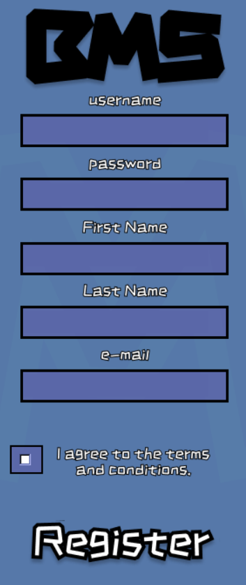
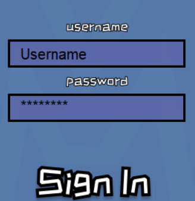
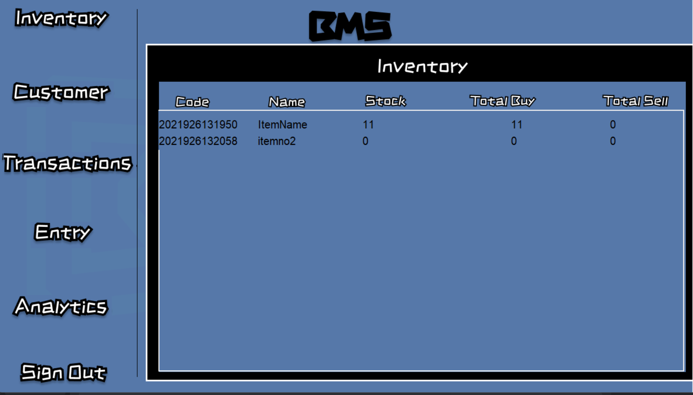
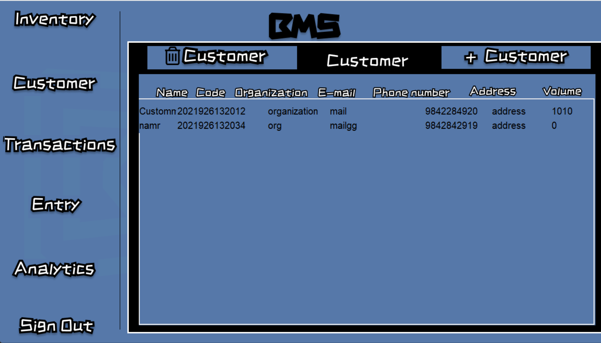
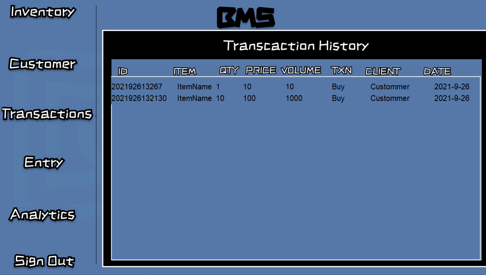
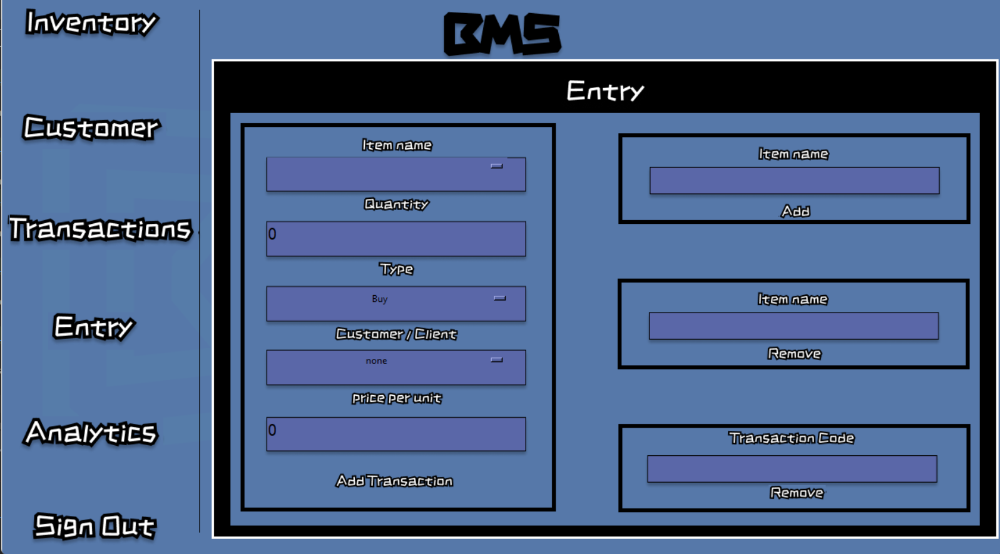
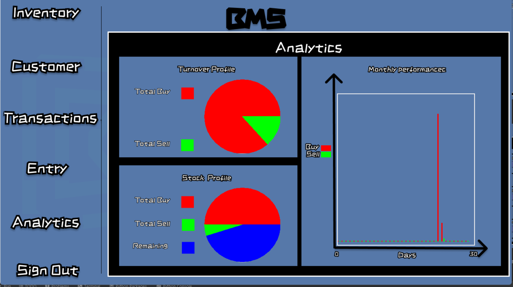

<h1>

BMS

</h1>

<h2>
Read Me:
</h2>
<h3>
This is a simple and usable program that can help in basics for good ledger management of a company or a business.

Some of the basic function of this program is to add buy sell records and view them. Also we can add customers and review
customer details as well. We can also study a basic pie chart indicating how much turnover has been made and shows portion
of remaining stock. It also shows a graph for the current month and volume of buy sell in the very month.
</h3>

You can register as a new user and Sign in once you are registered. This way, it is less likely that other people having access
to your device won't have access to get into your software.

Here you can register as a new user with unique username and email.

Then you can sign in to the account you just created.

In the inventory page, you can check for the remaining stock of the items.

In the customers page, you can view the existing customers or click on add or remove customers.

In the transaction history, you can check for the past transactions.

In the entry page, you can add a new transaction or remove an existing transaction.
You can also add or remove items from this page.

This is the Analytics page where users can find their buy sell volume and quantity in graphics.
